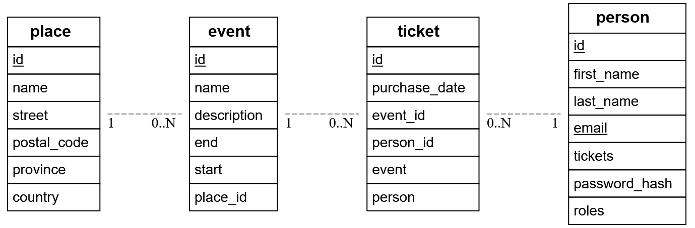

# Cody Van Hauwermeiren (293731cv)

- [ ] Front-end Web Development
    - <GITHUB_REPO_LINK_HIER>
    - <LINK_ONLINE_VERSIE_HIER>
- [x] Web Services:
    - <https://github.com/CodyVH-hogent/Evenementen.git>
    - <https://webservices-evenementen.onrender.com>

**Logingegevens**

- Gebruikersnaam/e-mailadres: admin@events.be
- Wachtwoord: wachtwoordAdmin

- Gebruikersnaam/e-mailadres: user@events.be
- Wachtwoord: wachtwoordUser

## Projectbeschrijving

Het project is een rest-api die het mogelijk maakt om places, events, tickets en persons toe te
voegen/wijzigen/verwijderen aan/uit een databank. Zie volgend schema voor meer verduidelijking.

Je moet in staat zijn, via de juiste endpoints, al deze data aan te passen, weliswaar met de juiste permissies(zie
verder).

## API calls

### Gebruikers (person)

- `GET /api/persons`: alle gebruikers ophalen ***ADMIN***
- `GET /api/persons/:id`: gebruiker met een bepaald id ophalen ***ADMIN/EIGEN***
- `PATCH /api/persons:id`: gebruiker met een bepaald id aanpassen ***ADMIN/EIGEN***
- `DELETE /api/persons/:id`: gebruiker met een bepaald id verwijderen ***ADMIN/EIGEN***
- `DELETE /api/persons`: alle gebruikers verwijderen ***ADMIN***
- `GET /api/persons/login`: gebruiker inloggen (token ophalen)
- `GET /api/persons/register`: gebruiker aanmaken

### Evenementen (event)

- `GET /api/events`: alle events ophalen
- `GET /api/events/:id`: event met een bepaald id ophalen
- `PATCH /api/events:id`: event met een bepaald id aanpassen ***ADMIN***
- `DELETE /api/events/:id`: event met een bepaald id verwijderen ***ADMIN***
- `DELETE /api/events`: alle events verwijderen ***ADMIN***
- `POST /api/events`: event aanmaken ***ADMIN***

### ticketen (ticket)

- `GET /api/tickets`: alle ticketen ophalen
- `GET /api/tickets/:id`: ticket met een bepaald id ophalen
- `PATCH /api/tickets:id`: ticket met een bepaald id aanpassen ***ADMIN***
- `DELETE /api/tickets/:id`: ticket met een bepaald id verwijderen ***ADMIN***
- `DELETE /api/tickets`: alle ticketen verwijderen ***ADMIN***
- `POST /api/tickets`: ticket aanmaken ***ADMIN***

### Tickets (ticket)

- `GET /api/tickets`: alle tickets ophalen ***ADMIN***
- `GET /api/tickets/:id`: ticket met een bepaald id ophalen ***ADMIN***
- `PATCH /api/tickets:id`: ticket met een bepaald id aanpassen ***ADMIN***
- `DELETE /api/tickets/:id`: ticket met een bepaald id verwijderen ***ADMIN***
- `DELETE /api/tickets`: alle tickets verwijderen ***ADMIN***
- `POST /api/tickets`: ticket aanmaken ***ADMIN***

## Behaalde minimumvereisten

### Web Services

- **datalaag**

    - [x] voldoende complex (meer dan één tabel, 2 een-op-veel of veel-op-veel relaties)
    - [x] één module beheert de connectie + connectie wordt gesloten bij sluiten server
    - [ ] heeft migraties - indien van toepassing
        - nvt
    - [x] heeft seeds

- **repositorylaag**

    - [ ] definieert één repository per entiteit (niet voor tussentabellen) - indien van toepassing
        - nvt
    - [ ] mapt OO-rijke data naar relationele tabellen en vice versa - indien van toepassing
        - nvt

- **servicelaag met een zekere complexiteit**

    - [x] bevat alle domeinlogica
    - [x] bevat geen SQL-queries of databank-gerelateerde code

- **REST-laag**

    - [x] meerdere routes met invoervalidatie
    - [x] degelijke foutboodschappen
    - [x] volgt de conventies van een RESTful API
    - [x] bevat geen domeinlogica
    - [x] geen API calls voor entiteiten die geen zin hebben zonder hun ouder (bvb tussentabellen)
    - [x] degelijke authorisatie/authenticatie op alle routes

- **algemeen**

    - [x] er is een minimum aan logging voorzien
    - [x] een aantal niet-triviale integratietesten (min. 1 controller >=80% coverage)
    - [x] minstens één extra technologie
        - orm, prisma
    - [x] maakt gebruik van de laatste ES-features (async/await, object destructuring, spread operator...)
    - [x] duidelijke en volledige README.md
    - [x] volledig en tijdig ingediend dossier en voldoende commits

## Projectstructuur

### Web Services

Ik heb in het algemeen de structuur gevolgd die beschreven stond in de cursus, maar heb enkele zaken aangepast:

- data
    - Ik heb ervoor gekozen geen data folder aan te maken en al deze logica aan de prisma folder bij te voegen
    - 
- repository
    - Aangezien ik prisma heb gebruikt, was het niet verplicht om deze te gebruiken aangezien je de databank
      rechtstreeks aanspreekt met ingebouwde methodes van Prisma. En dat heb ik dus niet gedaan.
    - 
- tests
    - Er is een extra folder `specs` waar alle individuele testen van de verschillende tabellen instaan.(momenteel enkel
      person 😢)
    - 

## Extra technologie

### Web Services

De extra technologie die ik gehanteerd heb, is de Prisma orm. Deze laat toe databank interacties in de applicatie te
beheren op een simpelere manier adn bv Knex. Voor dit project was dit een beetje overkill, maar was leuk als uitdaging
aangezien de uitvoering niet altijd parallel is met de cursus.

Eerst en vooral maak je een Prisma object(new PrismaClient) aan en geef je de juiste credentials mee (url, naam, ed.).
Dan kun je aan de hand van een zelfgeschreven methode getPrisma overal aan het Prisma object waarop je dan zaken kan
toevoegen/verwijderen door gebruik te maken van de ingebouwde methodes.

## Testresultaten

### Web Services

Ik heb enkel testen geschreven voor `person` aangezien ik het schrijven ervan duidelijk heb onderschat en te laat was
begonnen dus.
Mijn testen staan in de `root/__tests__/` folder met daarin de `global.setup` en `global.teardown` die alles opzetten en
terug afbreken. `global.setup` zorgt ervoor dat er twee personen worden aangemaakt in de databank(admin en user) zodat
deze later
gebruikt kunnen worden om in te loggen via de `supertest.setup`. Dit laatste bestand wordt dus uitgevoerd voor er nog
maar één test gedaan wordt en logt 2 gebruikers in zodat de tokens van beide worden opgehaald en gebruikt kunnen worden
in de tests. Nadat alle tests uitgevoerd zijn runt de `global.teardown` om alle data van elke tabel te verwijderen en
de connectie te stoppen.

Ik test alle endpoints van person telkens met zowel admin als user om zoveel mogelijk edge cases te vermijden. De tests
worden dan per endpoint zowel correct als incorrect uitgevoerd (bv. body{password,email}) en ook nog eens met extra
parameters
in de url.

## Gekende bugs

### Web Services

Recent kan ik geen places, events, tickets meer aanmaken/updaten.

### Web Services

- Gelukkig nieuwjaar mevrouw Samyn
